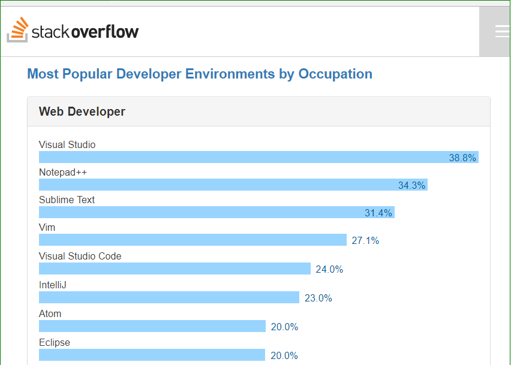
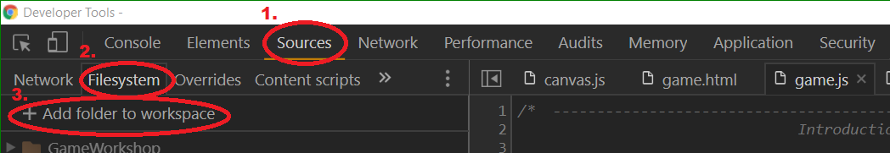

# Text Editor

If you don't have one, get a nice text editor.  This is entirely optional.
You can use whatever you feel comfortable with.  If you don't want to do
this right now, you can actually edit documents from inside Google Chrome '
or Mozilla Firefox.

## Some Commonly Used Editors

Here are some some commonly used text editors, based on a [2017 survey from Stack Overflow Insights](https://insights.stackoverflow.com/survey/2017#technology-most-popular-developer-environments-by-occupation
). 

https://insights.stackoverflow.com/survey/2017#technology-most-popular-developer-environments-by-occupation

## Google Chrome / Chromium

You can also use Google Chrome (or [Chromium](https://www.chromium.org/Home)) as a text editor, which has some built-in features that can help you figure out what's happening on a web page.

### Developer Tools

There are several ways to open the Chrome **Developer Tools**:

* Select the Chrome menu (icon with 3 dots or 3 bars) at the top-right of your browser window, then select **Tools > Developer Tools**.
* Right-click on any page element and select **Inspect Element**.
* Press the keys `ctrl+Shift+I` (or `Cmd+Opt+I` on Mac).

At this point, it can be helpful to detach the developer tools into a
separate window.  Which you can do by 

1. clicking on the menu in the upper-right corner of the screen
2. changing the option "Undock into a separate window" 

### Source Editor

Next, you want to open your files in the editor.  To reach them:

1.  Go to the **Sources** tab. 
2.  Open the **Filesystem** from side-bar on the left-hand side.
3.  **Add Folder to workspace**.

 
