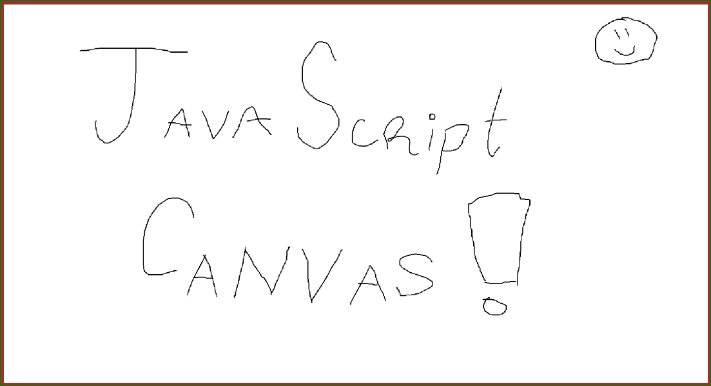

# Welcome to the Canvas!

The Canvas is an HTML element that acts like a picture, but easily allows you to draw anything you want!  It works really well with drawing lines, shapes, animations, and is great for making things like games.

## Overview

1. [Getting Started](#1-getting-started)
2. [Events](#2-events)
3. [Paths](#3-paths)

- [Next Steps](#next-steps)
- [Advanced Topics](#advanced-topics)
- [References and Links](#references-and-links)

# 1. Getting Started

## New File

Make a new empty text file, and add some basic tags to it.

~~~html
<html>
<body>

<canvas></canvas>

</body>
</html>
~~~

Alternatively, you can make separate files, such as `style.css` and `script.js`.

## Canvas Element

In your **HMTL**, you can add a canvas element, and define it's width and height.
You can change it to anything you want.

~~~html
<canvas width="500" height="500">
</canvas>
~~~

Next, add **CSS** to your canvas.  For now, let's draw a border
around the canvas area, and place it in the upper-left corner of the screen.

~~~css
canvas {
  position: fixed;
  top: 0;
  left: 0;
  background: #AAF;
}
~~~

This CSS code places the canvas 0 pixels away from the top of the screen,
and 0 pixels away from the left of the screen.  This is a good way to
think about (*x*,*y*) coordinates, because (0,0) starts at the upper-left 
corner of the screen.

## Canvas Context

Now we get to the **JavaScript**. Start using the canvas by getting its context.
Add these lines to your script:
~~~js
let canvas = document.querySelector('canvas');
let c = canvas.getContext('2d');
~~~
Most of the fun drawing functions in canvas are used through the context, 
which we just stored in the variable `c`.

Test it out by drawing a red rectangle...
~~~js
c.fillStyle = 'red';
c.fillRect(x, y, width, height);
~~~
...where *x, y* is the upper-left corner of the rectangle.

Experiment with different number values for x, y, width, and height. 
Try different colors by changing fill style.

Here's a finished example after adding everything from above: 
**[1: Getting Started Example](1_getting_started/1.html)**

# 2. Events

## Mouse Event

Now, let's interact with our canvas!  Inside the HTML canvas element, add the `onmousedown` property,
~~~html
<canvas width='500' height='500'
    onmousedown="drawBox(event);">
~~~

The function `drawBox(event)` is triggered whenever you press down on the mouse inside the canvas element. **Each time** you press down on the mouse, the object named `event` is created, and passed into the function.

## Event Handlers

Next, we need to write the `drawBox(event)` function in javascript.  Add this to your script,
~~~js
function drawBox(event) {
    console.log(event);
}
~~~
Functions that are triggered by events are often called **Event Handlers** because they will "handle the event" for us.  Let's load up the web page to see what's happens in the console when we click on the box.

## Properties of Events

If all goes well, you should see the mouse Event logged in your console.  Try opening one up and looking at the vast number of different things recorded by this event.  Don't worry about trying to understand all of these (I certainly don't).

Here are some of the properties we often are interested in:
- `event.type` will tell you what kind of event it is.  In our example this would be "mousedown".
- `event.x` is the mouse cursor's *x* position on the screen at the time of the event.  
- `event.y` is the cursor's *y* position.

Now let's try drawing a box at the place you clicked!
~~~js
function drawBox(event) {
  let x = event.x;
  let y = event.y;
  c.strokeStyle = 'orange'
  c.fillRect(x-5, y-5, 10, 10);
}
~~~
Reload the page and try it out!

Here's what we have so far: **[2. Events Example](2_events/2.html)**

# 3. Paths 

Let's say we want something more interesting than a rectangle in our drawBox function.  We can make custom shapes by drawing lines directly using Paths.  Let's make a plus sign + inside of the box we already have.

    
Create a new function called drawPlus. Most likely, we will want parameters for the location of the center, and the length of the box.

**Try it!  Replace the '?'s with numbers to draw the plus**
~~~js
function drawPlus(centerX, centerY, sideLength) {
    c.beginPath();

    c.moveTo(?, ?);
    c.lineTo(?, ?);

    c.moveTo(?, ?);
    c.lineTo(?, ?);

    c.closePath();
    c.stroke();
}
~~~

Here are some of the path-drawing functions and a metaphor for what they do:

* `beginPath()` puts the point of a pencil onto the page, ready to draw a line.

* `moveTo(x, y)` acts like you are picking up the pencil, and placing it back down at the (x,y) location.

* `lineTo(x, y)` drags the pencil to (x,y)

* `closePath()` picks the pencil back up and puts it away.

* `stroke()` takes your pencil drawings and prints them onto the screen.

## Use your new function

Once you've finished writing up the path function, let's test it by adding it into our drawBox function,
~~~js
function drawBox(event) {
  let x = event.x;
  let y = event.y;
  c.strokeStyle = 'orange'
  c.strokeRect(x-5, y-5, 10, 10);

  drawPlus(x, y, 10);
}
~~~

Now reload the page, and try clicking around!  If you see a plus sign + enclosed by a square... then congrats!

Here's what we have so far: **[3. Paths Example](3_paths/3.html)**

# Next Steps

### More Drawings
-   [Using Images](https://developer.mozilla.org/en-US/docs/Web/API/Canvas_API/Tutorial/Using_images)
-   [Animations](https://developer.mozilla.org/en-US/docs/Web/API/Canvas_API/Tutorial/Basic_animations)

### More Events
-   [Touch Events](https://developer.mozilla.org/en-US/docs/Web/API/Touch_events)
-   [Keyboard Events](https://developer.mozilla.org/en-US/docs/Web/API/KeyboardEvent)

### Project and More!
-   [Make a Javascript Robot](http://eloquentjavascript.net/07_robot.html)
-   [Web Game Development](https://developer.mozilla.org/en-US/docs/Games)

# Advanced Topics

-   [Anatomy of a video game](https://developer.mozilla.org/en-US/docs/Games/Anatomy) talks dealing with game loops, constantly updating graphics, and maintaining frame rates.

# References and Links

-   The very helpful [*Eloquent Javascript*](http://eloquentjavascript.net)
    has a chapter called [Drawing on Canvas](http://eloquentjavascript.net/17_canvas.html),
    which goes over some of the basic topics in canvas, 
    and relates them to other concepts in javascript and HTML.

-   [Mozilla Developer Net - Canvas API](https://developer.mozilla.org/en-US/docs/Web/API/Canvas_API)
    is a great reference to look up canvas commands.  there is also a great [Canvas Tutorial](https://developer.mozilla.org/en-US/docs/Web/API/Canvas_API/Tutorial/), and some more
    in-depth information about the specifics of how canvas works.

-   [Mozilla Developer Net - Web Technology for Developers](https://developer.mozilla.org/en-US/docs/Web)
    is a great place to explore.

Codepen: **[Drawing Shapes](https://codepen.io/fractalbach/pen/gzLZoQ?editors=0010#0)**

Codepen: **[Mouse Events](https://codepen.io/fractalbach/pen/gzLZoQ?editors=1011)**

