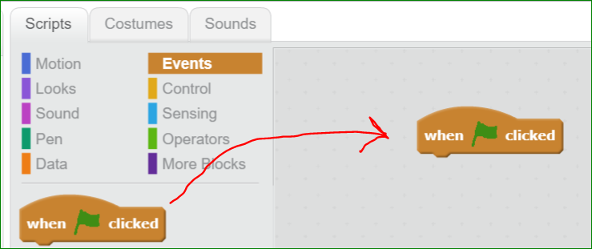
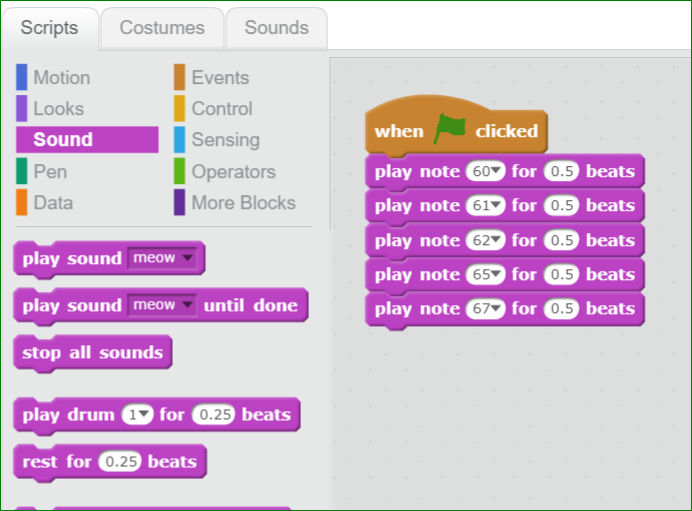
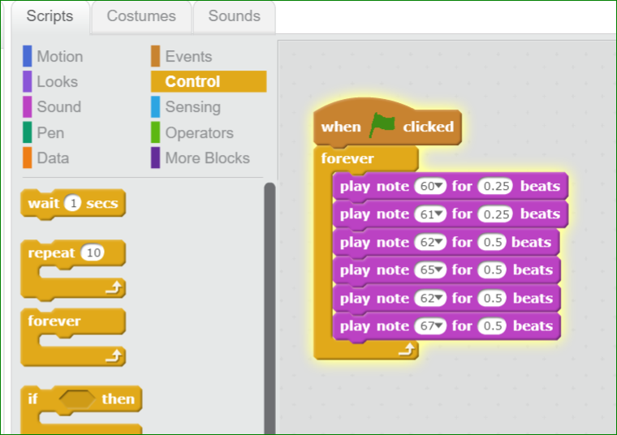
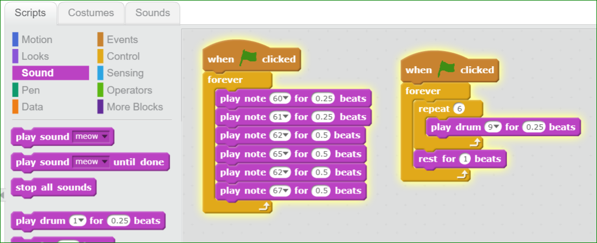

Scratch
==========================================

You can make a new Scratch project by going to:
https://scratch.mit.edu/projects/editor/

## Intro
- code = blocks.
- real coding is actually similar to working with blocks.
- Abstraction = only need to think about what the block as a whole does.
- Interface = the outline of the block is the interface.
- Once you design a block, you can re-use it to make more complex things

## How Things Happen 

Things happen procedurally, you go from the top block, to the next block.
**Event** blocks are triggered by certain events that happen on the webpage,
which could be things that you do (like pressing buttons), or things that happen
internally.  Once a block is "triggered", the procedure is kicked off.

1.  Go to **Events** tab, and drag the "when flag is clicked" block 
    into to the gray area on the right-hand side.
    
    

1.  Add some sounds to the block below.  When you have selected a few blocks,
    press the green flag button on the left-hand side of the screen to hear
    your music!

    

You have just created a program!
Congratulations, you are now a computer programmer!

## Loops

Loops are a very common thing in programming.
They also show up a lot in music!

1.  Go to **Control**, this section contains looping blocks.
    Try using a "forever" block, and placing it around your notes.  This block is similar to `while(true)` in programming languages like C.

    

2.  Let's make the song more interesting.
    Go back to the **Events** Tab, and drag in another
    "when flag is clicked" block.  Place it somewhere away from the first one.  Now go back to **Control** and add another "Forever" loop.  Now you have 2 musicians playing!
    Experiment with the **Repeat** Loop and see what sort of music you can create!

    

